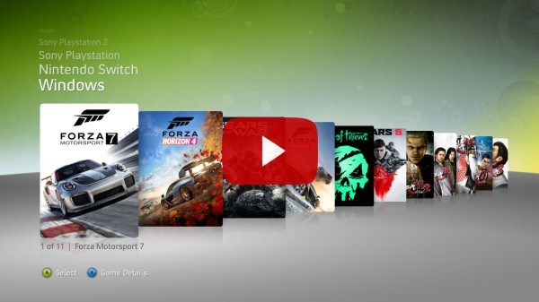

# New Pegasus Experience Theme
NPE is a theme for the  [Pegasus Frontend](https://pegasus-frontend.org/) that aims to recreate the classical Xbox 360 "NXE" Dashboard experience. A lot of time was spent getting things to look exactly as they did on the original hardware, I hope you enjoy it!

## Demo Video

## Installation
To install this theme, first download this repository (either through `git clone https://github.com/riquenunes/pegasus-theme-npe.git` or through downloading [this ZIP](https://github.com/riquenunes/pegasus-theme-npe/archive/refs/heads/master.zip)), then move (and extract if you downloaded the zip here) to [your themes folder](https://pegasus-frontend.org/docs/user-guide/installing-themes/). After that you should be able to see the theme in the Pegasus settings screen.

## Scraping
While the UI will try it's best to work without having every bit of information available, in order to get the best experience possible with this theme, it is recommended that you scrape the following information:
- Game Library Page
    - Metadata: `title`
    - Assets: `boxFront` or `poster` or `steam` or `banner` or `logo`
- Details Page
    - Metadata: `title`, `rating`, `developer`, `publisher` and `description` (or `summary`)
    - Assets:
        - Watch Preview: `video`
        - Background: `background` or `screenshot` or `titlescreen`
        - Image Viewer: `screenshot` or `titlescreen` or `banner`
        - Game cover: `poster` or `boxFront` or `logo`
